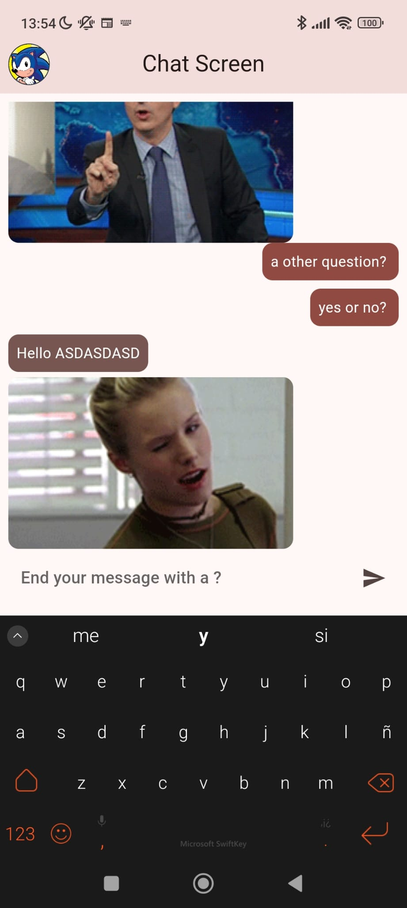

# first_flutter_app
First app in Flutter for learning mobile development 

Something like this

write a question ending in a question mark and the answer will be a gif
image retrieved from yesno.wtf

Para la applicación de horóscopo: 

https://www.figma.com/design/2gy19QdJ01nB21uvWrcv3r/Mobile-Payment-App-UI-Dark-theme-(Community)?node-id=0-1&node-type=CANVAS&t=pZToC0dSxIl3xpNd-0
https://www.figma.com/community/file/1320093355098935734

Mira esta API:

https://rapidapi.com/gbattaglia/api/astrologer

Para el tema de AI 

https://dribbble.com/shots/24219959-Design-Concept-for-Horoscope-App

https://arthub.ai/ 